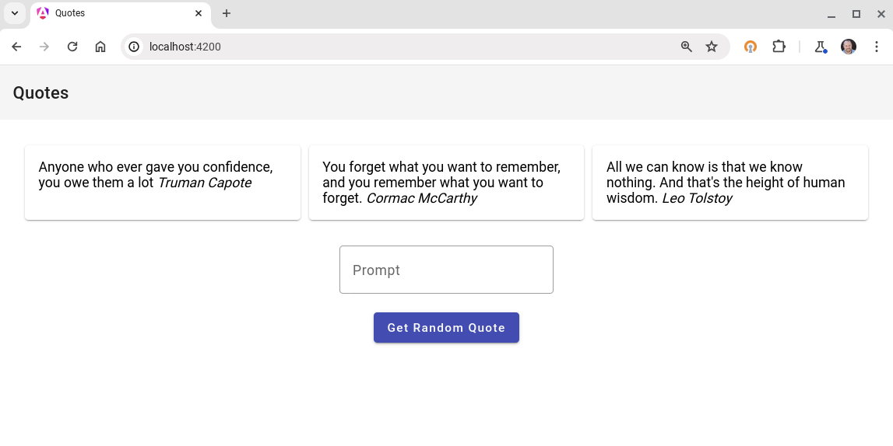

# Quotes

Simple Angular / Typescript app used to serve content from 2 backend services:

* [All Quotes](https://github.com/GoogleCloudPlatform/serverless-production-readiness-java-gcp/)
* [Random Quote Generator using Google's API Gemini 1.5](https://github.com/jjdelorme/generative-quote)

The finished website looks like this:

When run from the [main](https://github.com/jjdelorme/quotes-web) branch, dummy data will be inject.  The [complete](https://github.com/jjdelorme/quotes-web/tree/complete) branch has the actual completed code wiring up to the backend services.

## Development server

This project was generated with [Angular CLI](https://github.com/angular/angular-cli) version 17.0.5.

Run `ng serve` for a dev server. Navigate to `http://localhost:4200/`. The application will automatically reload if you change any of the source files.

## Build

Run `ng build` to build the project. The build artifacts will be stored in the `dist/` directory.

